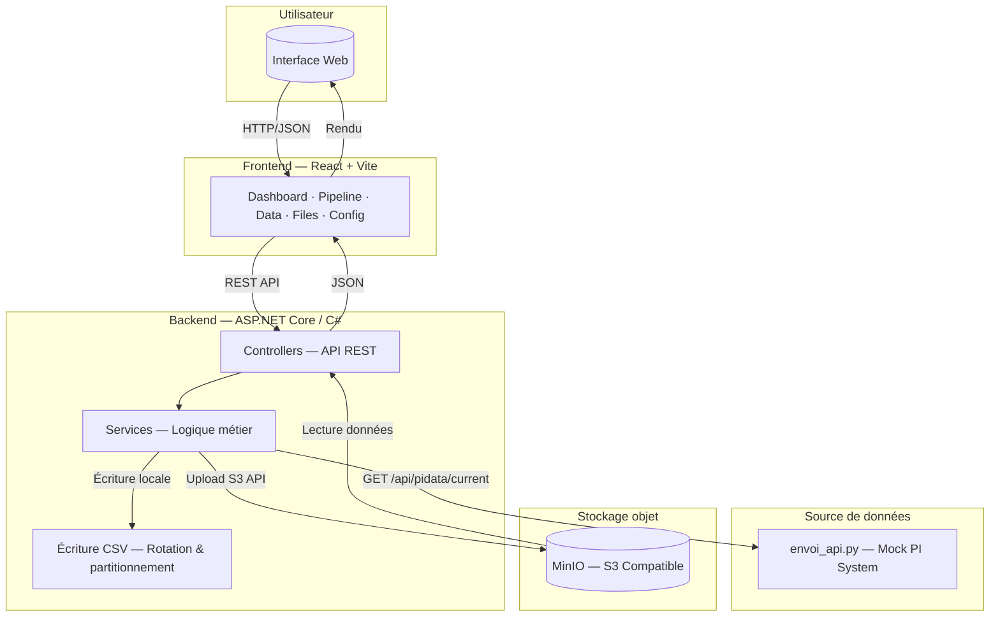
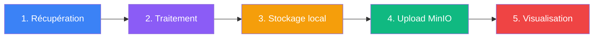
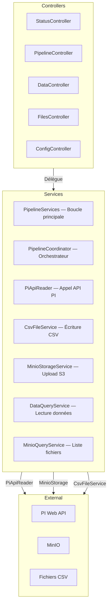
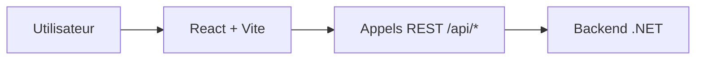
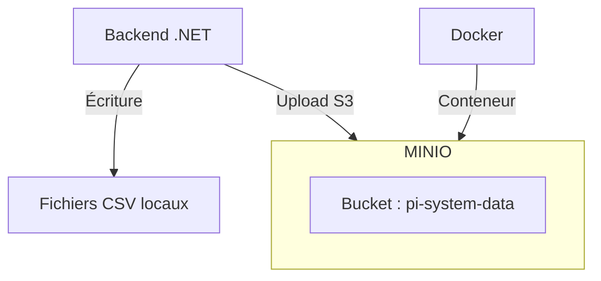

# BizDataRouterToMinio

Collecte automatique des données industrielles depuis PI System, stockage dans MinIO via CSV, et supervision en temps réel avec une interface web React.

---

## Architecture



---

## Comment fonctionne le projet ?



| Étape | Description |
|-------|-------------|
| **1. Récupération** | Le backend interroge PI Web API chaque seconde pour récupérer les données capteurs (pressure, température, etc.) |
| **2. Traitement** | Les données JSON sont désérialisées et transformées en lignes CSV avec valeurs et qualité |
| **3. Stockage local** | Les données sont écrites en mode append dans des fichiers CSV partitionnés par date (`_year=YYYY_month=MM_day=DD_part=N.csv`) |
| **4. Upload MinIO** | Quand un fichier atteint 50 MB ou qu'un nouveau jour commence, le CSV est uploadé sur MinIO via l'API S3 |
| **5. Visualisation** | L'interface React permet de superviser le pipeline, explorer les données par date, et consulter les fichiers stockés |

---

## Architecture du Backend



| Couche | Rôle |
|--------|------|
| **Controllers** | Exposent l'API REST — reçoivent les requêtes HTTP et retournent du JSON |
| **Services** | Contiennent la logique métier — collecte, traitement, stockage |
| **Models / DTOs** | Transportent les données entre les couches (structures typées) |
| **Configuration** | Paramètres de l'application (`appsettings.json` → objets C#) |

---

## Frontend



| Page | Route | Description |
|------|-------|-------------|
| Dashboard | `/` | Vue d'ensemble : métriques, status, dernières mesures |
| Pipeline | `/pipeline` | Contrôle Start / Stop / Restart du pipeline |
| Data | `/data` | Explorateur de données par date |
| Files | `/files` | Liste et détail des fichiers MinIO |
| Configuration | `/configuration` | Paramètres du backend (lecture seule) |

---

## Stockage & Infrastructure



| Composant | Rôle |
|-----------|------|
| **MinIO** | Serveur de stockage objet compatible S3 — stocke les fichiers CSV de manière centralisée |
| **Docker** | Conteneurise MinIO pour un déploiement portable et reproductible |
| **CSV** | Format d'interopérabilité — les données passent par des fichiers CSV avant d'entrer dans MinIO |

---

## Structure du projet

```
BizDataRouterToMinio/
├── backend/
│   ├── Controllers/         ← Endpoints API REST
│   ├── Services/            ← Logique métier
│   ├── Models/              ← DTOs et modèles
│   ├── Configuration/       ← Paramètres typés
│   ├── data/                ← Fichiers CSV écrits localement
│   ├── documentation/       ← Notes et captures d'écran
│   ├── Program.cs           ← Point d'entrée
│   ├── appsettings.json     ← Configuration
│   └── envoi_api.py         ← Mock PI System (FastAPI)
│
├── frontend/
│   └── src/
│       ├── pages/           ← 5 pages React
│       ├── components/      ← Composants réutilisables
│       ├── services/        ← Appels API
│       ├── styles/          ← CSS
│       └── utils/           ← Utilitaires de formatage
│
└── README.md
```

---

## Quick Start

### 1. MinIO

```powershell
docker run -p 9000:9000 -p 9001:9001 minio/minio server /data --console-address ":9001"
```

### 2. Mock PI System

```powershell
cd backend
python -m uvicorn envoi_api:app --host 127.0.0.1 --port 3000
```

### 3. Backend

```powershell
cd backend
dotnet run --urls http://localhost:5000
```

### 4. Frontend

```powershell
cd frontend
npm install
npm run dev
```

> **URL** : `http://localhost:5173`

---

## Technologies

| Technologie | Version | Rôle |
|-------------|---------|------|
| .NET | 10.0 | Framework backend |
| C# | — | Langage backend |
| React | 19 | Framework frontend |
| Vite | 8 | Bundler frontend |
| MinIO | 7.0 (SDK) | Stockage objet S3 |
| CsvHelper | 33.1 | Lecture/écriture CSV |
| FastAPI | — | Mock PI System |
| Docker | — | Conteneurisation MinIO |
| PI Web API | — | Source de données industrielles |
